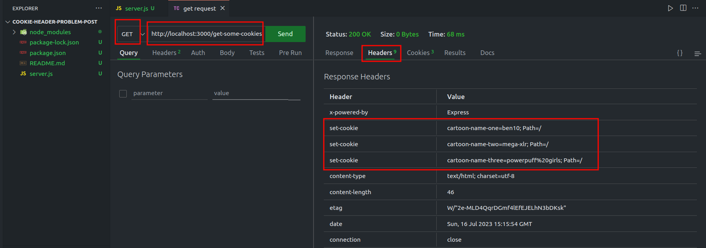
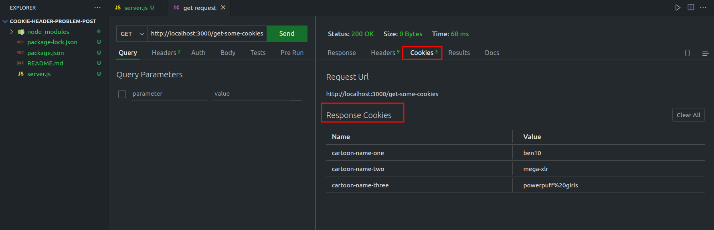
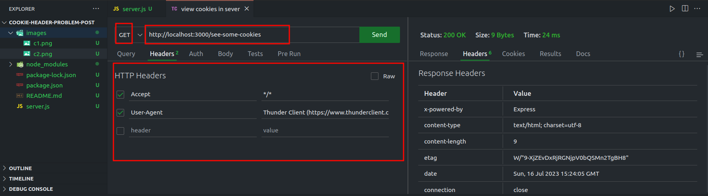
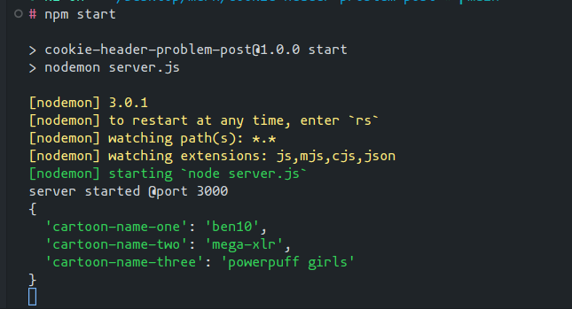

# You will find all the code in the **server.js** file.

## Instructions:

- Go to terminal and run the command `npm start` for starting the development sever.
- There are only two routes/URLs.

  - **/get-some-cookies** --> for getting cookies and
  - **/see-some-cookies** --> for logging(viewing) those -cookies in the server console.

 
 

## Lets send our first request and get some cookies.

Send a **GET** request to this url : **http://localhost:3000/get-some-cookies**

This is the output:

_So you can see we have got some cookies from the server.And as mentioned in my post they are sent from the server using the **Set-cookie** http header._

 
 
 
 

## Lets send a second request to the server

Send a **GET** request to this url : **http://localhost:3000/see-some-cookies**

Now observe very carefully you are not sending the cookies to the server using the **Cookie** header. In fact there is no **Cookie** header.

However , if you see the console you will see that the server has received all the cookies. So it works ,cookies are sent to the server, but not the way you want!!

